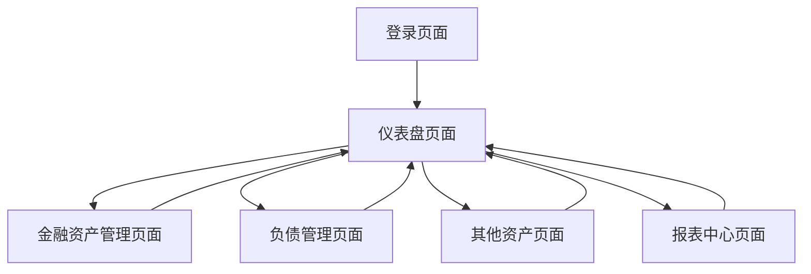

## 1. Product Overview
简化版个人资产管理系统，帮助用户全面管理个人财务状况。通过整合金融资产、负债管理、其他资产等模块，提供实时净资产计算和资产变动趋势分析，让用户清晰掌握个人财务健康状况。

目标用户为有个人理财需求的普通用户，产品价值在于提供简单易用的资产管理工具，帮助用户做出更明智的财务决策。

## 2. Core Features

### 2.1 User Roles
| Role | Registration Method | Core Permissions |
|------|---------------------|------------------|
| 普通用户 | 邮箱注册 | 管理个人资产、查看报表、导出数据 |

### 2.2 Feature Module
个人资产管理系统包含以下核心页面：
1. **登录页面**：用户身份验证、密码找回
2. **仪表盘页面**：资产总览、净资产显示、趋势图表
3. **金融资产管理页面**：股票账户、支付宝基金、银行卡、微信钱包管理
4. **负债管理页面**：信用卡、花呗、京东白条管理
5. **其他资产页面**：薅羊毛收益、实物资产、虚拟资产管理
6. **报表中心页面**：每日资产报告、数据导出、资产占比图表

### 2.3 Page Details
| Page Name | Module Name | Feature description |
|-----------|-------------|---------------------|
| 登录页面 | 身份验证 | 输入邮箱密码登录系统，支持记住登录状态 |
| 仪表盘页面 | 资产总览 | 显示总资产、总负债、净资产，支持人民币格式显示 |
| 仪表盘页面 | 趋势图表 | 展示7日、30日、90日资产变动趋势折线图 |
| 金融资产管理页面 | 股票账户管理 | 录入当日持仓余额、当日收益/亏损、累计收益，自动计算股票总资产 |
| 金融资产管理页面 | 支付宝基金管理 | 录入基金持仓余额、当日收益/亏损、累计收益，自动计算基金总资产 |
| 金融资产管理页面 | 银行卡管理 | 录入多张银行卡余额，自动汇总银行卡总资产 |
| 金融资产管理页面 | 微信钱包管理 | 录入微信零钱余额，实时显示 |
| 负债管理页面 | 信用卡管理 | 录入每张信用卡授信额度、已用额度，自动计算可用额度和总欠款 |
| 负债管理页面 | 花呗管理 | 显示当前欠款总额、可用额度，支持额度设置 |
| 负债管理页面 | 京东白条管理 | 展示当前欠款、可用额度，支持额度设置 |
| 其他资产页面 | 薅羊毛收益 | 记录各类优惠活动、返利、红包收入，支持分类管理 |
| 其他资产页面 | 实物资产管理 | 登记数码产品、奢侈品等保值物品当前估值 |
| 其他资产页面 | 虚拟资产管理 | 管理游戏账号、装备、皮肤等可交易虚拟物品估值 |
| 报表中心页面 | 每日资产报告 | 生成当日净资产报告，包含大写金额显示 |
| 报表中心页面 | 资产占比图表 | 展示各模块资产占比饼图，支持交互查看详情 |
| 报表中心页面 | 负债率计算 | 自动计算并显示负债率（总负债/总资产*100%） |
| 报表中心页面 | 数据导出 | 支持Excel格式导出所有原始数据和计算结果 |

## 3. Core Process
用户首次使用需注册账号并登录系统。登录后进入仪表盘查看资产总览，可分别管理金融资产、负债和其他资产。系统实时计算总资产、总负债和净资产，提供多时间段趋势分析。用户可生成每日资产报告并导出数据。

## 4. User Interface Design

### 4.1 Design Style
- 主色调：深绿色（#2E7D32）代表财富增长
- 辅助色：浅灰色（#F5F5F5）背景，白色卡片
- 按钮样式：圆角矩形，悬停效果
- 字体：系统默认字体，标题18px，正文14px
- 布局风格：卡片式布局，左侧导航栏
- 图标风格：简约线性图标，使用emoji增强识别度

### 4.2 Page Design Overview
| Page Name | Module Name | UI Elements |
|-----------|-------------|-------------|
| 仪表盘页面 | 资产总览 | 顶部显示总资产卡片（绿色）、总负债卡片（红色）、净资产卡片（蓝色），金额使用¥符号，保留两位小数 |
| 仪表盘页面 | 趋势图表 | 使用Chart.js折线图，支持7日、30日、90日切换，深绿色线条，网格背景 |
| 金融资产管理页面 | 股票账户 | 卡片式布局，每只股票显示名称、持仓、当日盈亏（红绿箭头）、累计收益，顶部显示股票总资产 |
| 负债管理页面 | 信用卡列表 | 表格形式展示，包含银行名称、授信额度、已用额度、可用额度、使用率进度条 |
| 报表中心页面 | 资产占比饼图 | 使用不同颜色区分各模块，支持悬停显示具体金额和百分比 |

### 4.3 Responsiveness
桌面端优先设计，支持移动端自适应。在移动设备上采用响应式布局，导航栏变为汉堡菜单，卡片布局调整为单列显示，确保触控友好的交互体验。

### 4.4 3D Scene Guidance
本系统为纯2D金融管理应用，无需3D场景设计。