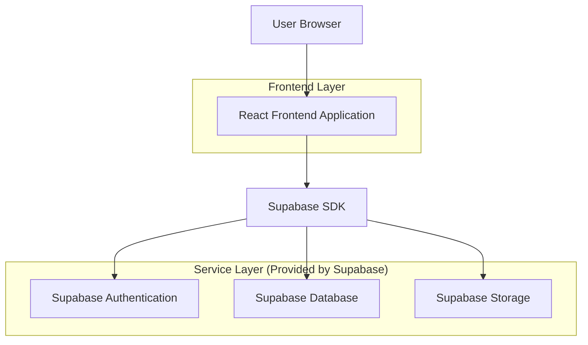
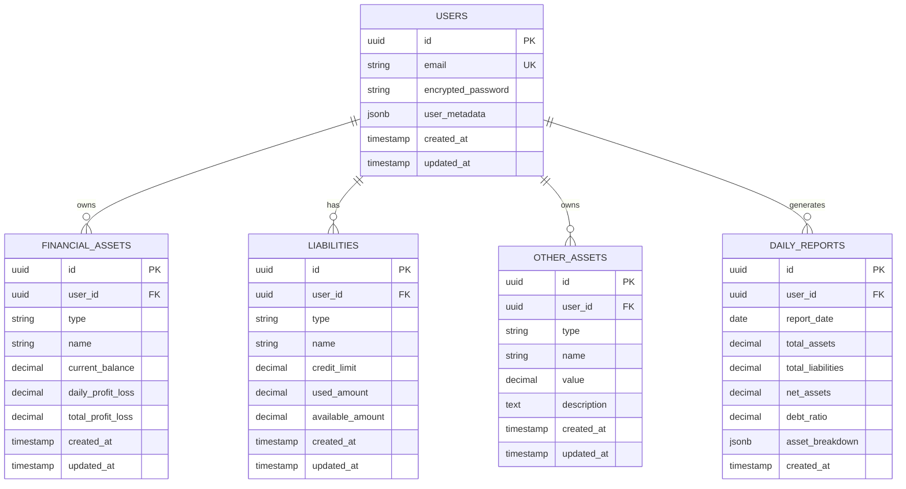

## 1.Architecture design



## 2.Technology Description
- Frontend: React@18 + tailwindcss@3 + vite
- Initialization Tool: vite-init
- Backend: Supabase (BaaS)
- Database: Supabase PostgreSQL
- Authentication: Supabase Auth
- File Storage: Supabase Storage
- Charts: Chart.js@4
- Excel Export: xlsx@0.18
- Data Encryption: crypto-js@4

## 3.Route definitions
| Route | Purpose |
|-------|---------|
| /login | 登录页面，用户身份验证 |
| /dashboard | 仪表盘页面，资产总览和趋势图表 |
| /assets/financial | 金融资产管理页面 |
| /assets/liabilities | 负债管理页面 |
| /assets/other | 其他资产管理页面 |
| /reports | 报表中心页面 |
| /profile | 用户资料页面 |

## 4.API definitions

### 4.1 Authentication API
```
POST /auth/v1/token
```
Request:
| Param Name | Param Type | isRequired | Description |
|------------|------------|------------|-------------|
| email | string | true | 用户邮箱地址 |
| password | string | true | 用户密码 |

Response:
```json
{
  "access_token": "eyJhbGciOiJIUzI1NiIsInR5cCI6IkpXVCJ9...",
  "token_type": "bearer",
  "expires_in": 3600,
  "user": {
    "id": "user_uuid",
    "email": "user@example.com"
  }
}
```

### 4.2 Financial Assets API
```
GET /rest/v1/financial_assets
POST /rest/v1/financial_assets
PUT /rest/v1/financial_assets?id=eq.{id}
DELETE /rest/v1/financial_assets?id=eq.{id}
```

Financial Asset Type:
```typescript
interface FinancialAsset {
  id: string
  user_id: string
  type: 'stock' | 'fund' | 'bank_card' | 'wechat'
  name: string
  current_balance: number
  daily_profit_loss: number
  total_profit_loss: number
  created_at: string
  updated_at: string
}
```

### 4.3 Liabilities API
```
GET /rest/v1/liabilities
POST /rest/v1/liabilities
PUT /rest/v1/liabilities?id=eq.{id}
```

Liability Type:
```typescript
interface Liability {
  id: string
  user_id: string
  type: 'credit_card' | 'huabei' | 'jd_baitiao'
  name: string
  credit_limit: number
  used_amount: number
  available_amount: number
  created_at: string
  updated_at: string
}
```

### 4.4 Other Assets API
```
GET /rest/v1/other_assets
POST /rest/v1/other_assets
```

Other Asset Type:
```typescript
interface OtherAsset {
  id: string
  user_id: string
  type: 'daily_earnings' | 'physical_assets' | 'virtual_assets'
  name: string
  value: number
  description?: string
  created_at: string
  updated_at: string
}
```

## 5.Server architecture diagram
本系统采用Supabase BaaS架构，无需自建服务器。所有业务逻辑通过Supabase客户端SDK在前端实现，数据存储和身份验证由Supabase服务提供。

## 6.Data model

### 6.1 Data model definition


### 6.2 Data Definition Language

Users Table:
```sql
CREATE TABLE users (
  id UUID PRIMARY KEY DEFAULT gen_random_uuid(),
  email VARCHAR(255) UNIQUE NOT NULL,
  encrypted_password VARCHAR(255) NOT NULL,
  user_metadata JSONB DEFAULT '{}',
  created_at TIMESTAMP WITH TIME ZONE DEFAULT NOW(),
  updated_at TIMESTAMP WITH TIME ZONE DEFAULT NOW()
);

-- Enable Row Level Security
ALTER TABLE users ENABLE ROW LEVEL SECURITY;

-- Create policies
CREATE POLICY "Users can view own profile" ON users FOR SELECT USING (auth.uid() = id);
CREATE POLICY "Users can update own profile" ON users FOR UPDATE USING (auth.uid() = id);
```

Financial Assets Table:
```sql
CREATE TABLE financial_assets (
  id UUID PRIMARY KEY DEFAULT gen_random_uuid(),
  user_id UUID NOT NULL REFERENCES users(id) ON DELETE CASCADE,
  type VARCHAR(20) NOT NULL CHECK (type IN ('stock', 'fund', 'bank_card', 'wechat')),
  name VARCHAR(100) NOT NULL,
  current_balance DECIMAL(12,2) NOT NULL DEFAULT 0.00,
  daily_profit_loss DECIMAL(12,2) NOT NULL DEFAULT 0.00,
  total_profit_loss DECIMAL(12,2) NOT NULL DEFAULT 0.00,
  created_at TIMESTAMP WITH TIME ZONE DEFAULT NOW(),
  updated_at TIMESTAMP WITH TIME ZONE DEFAULT NOW()
);

-- Create indexes
CREATE INDEX idx_financial_assets_user_id ON financial_assets(user_id);
CREATE INDEX idx_financial_assets_type ON financial_assets(type);

-- Enable RLS
ALTER TABLE financial_assets ENABLE ROW LEVEL SECURITY;

-- Create policies
CREATE POLICY "Users can view own financial assets" ON financial_assets FOR SELECT USING (auth.uid() = user_id);
CREATE POLICY "Users can insert own financial assets" ON financial_assets FOR INSERT WITH CHECK (auth.uid() = user_id);
CREATE POLICY "Users can update own financial assets" ON financial_assets FOR UPDATE USING (auth.uid() = user_id);
CREATE POLICY "Users can delete own financial assets" ON financial_assets FOR DELETE USING (auth.uid() = user_id);

-- Grant permissions
GRANT SELECT ON financial_assets TO anon;
GRANT ALL PRIVILEGES ON financial_assets TO authenticated;
```

Liabilities Table:
```sql
CREATE TABLE liabilities (
  id UUID PRIMARY KEY DEFAULT gen_random_uuid(),
  user_id UUID NOT NULL REFERENCES users(id) ON DELETE CASCADE,
  type VARCHAR(20) NOT NULL CHECK (type IN ('credit_card', 'huabei', 'jd_baitiao')),
  name VARCHAR(100) NOT NULL,
  credit_limit DECIMAL(12,2) NOT NULL DEFAULT 0.00,
  used_amount DECIMAL(12,2) NOT NULL DEFAULT 0.00,
  available_amount DECIMAL(12,2) NOT NULL DEFAULT 0.00,
  created_at TIMESTAMP WITH TIME ZONE DEFAULT NOW(),
  updated_at TIMESTAMP WITH TIME ZONE DEFAULT NOW(),
  CONSTRAINT check_credit_limit CHECK (used_amount <= credit_limit)
);

-- Create indexes
CREATE INDEX idx_liabilities_user_id ON liabilities(user_id);
CREATE INDEX idx_liabilities_type ON liabilities(type);

-- Enable RLS
ALTER TABLE liabilities ENABLE ROW LEVEL SECURITY;

-- Create policies
CREATE POLICY "Users can view own liabilities" ON liabilities FOR SELECT USING (auth.uid() = user_id);
CREATE POLICY "Users can insert own liabilities" ON liabilities FOR INSERT WITH CHECK (auth.uid() = user_id);
CREATE POLICY "Users can update own liabilities" ON liabilities FOR UPDATE USING (auth.uid() = user_id);
CREATE POLICY "Users can delete own liabilities" ON liabilities FOR DELETE USING (auth.uid() = user_id);

-- Grant permissions
GRANT SELECT ON liabilities TO anon;
GRANT ALL PRIVILEGES ON liabilities TO authenticated;
```

Daily Reports Table:
```sql
CREATE TABLE daily_reports (
  id UUID PRIMARY KEY DEFAULT gen_random_uuid(),
  user_id UUID NOT NULL REFERENCES users(id) ON DELETE CASCADE,
  report_date DATE NOT NULL,
  total_assets DECIMAL(15,2) NOT NULL DEFAULT 0.00,
  total_liabilities DECIMAL(15,2) NOT NULL DEFAULT 0.00,
  net_assets DECIMAL(15,2) NOT NULL DEFAULT 0.00,
  debt_ratio DECIMAL(5,2) NOT NULL DEFAULT 0.00,
  asset_breakdown JSONB DEFAULT '{}',
  created_at TIMESTAMP WITH TIME ZONE DEFAULT NOW(),
  UNIQUE(user_id, report_date)
);

-- Create indexes
CREATE INDEX idx_daily_reports_user_id ON daily_reports(user_id);
CREATE INDEX idx_daily_reports_date ON daily_reports(report_date);

-- Enable RLS
ALTER TABLE daily_reports ENABLE ROW LEVEL SECURITY;

-- Create policies
CREATE POLICY "Users can view own daily reports" ON daily_reports FOR SELECT USING (auth.uid() = user_id);
CREATE POLICY "Users can insert own daily reports" ON daily_reports FOR INSERT WITH CHECK (auth.uid() = user_id);

-- Grant permissions
GRANT SELECT ON daily_reports TO anon;
GRANT ALL PRIVILEGES ON daily_reports TO authenticated;
```